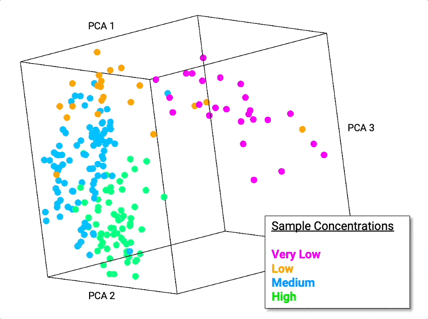

DQM: Dynamic Quantum Mapping
============================

Dynamic Quantum Mapping (DQM) is a unique, open-source system designed for exploring and understanding the intrinsic structure of high-dimensional numerical data.

DQM works on any given data set, using the mathematical framework of quantum mechanics, by creating a high-dimensional data-density map and then moving data points toward nearby regions of higher data density.

No assumptions are made about the underlying structure of the data.

Visual and numerical analysis of the resulting animated ‘evolution’ of the data can reveal both clusters and extended structures, leading to a rich understanding of relationships between and within different subsets of the data.

Contents
--------

.. toctree::
   :maxdepth: 1

   installation
   quick_start
   value_of_animation
   user_guide
   api
   faq
   links

|

.. centered:: Using the first 20 PCA dimensions (raw dimensions are from PCR melt curves), DQM reveals a 1-dimensional (*not* linear/straight) structure. The 1-D structure shows a strong correlation with sample concentration.

|
