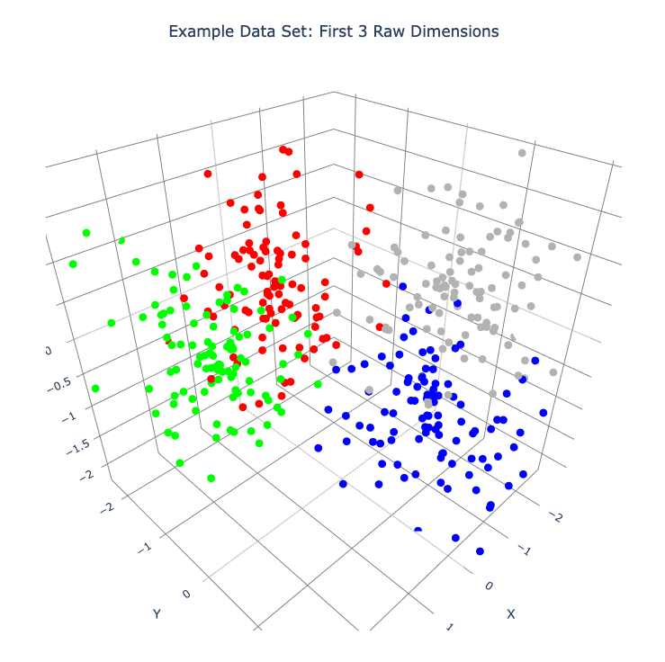
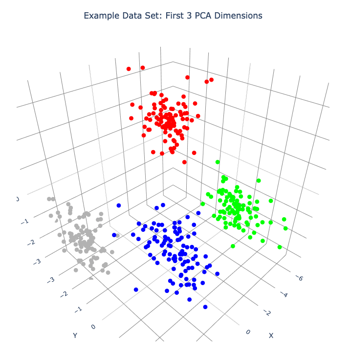
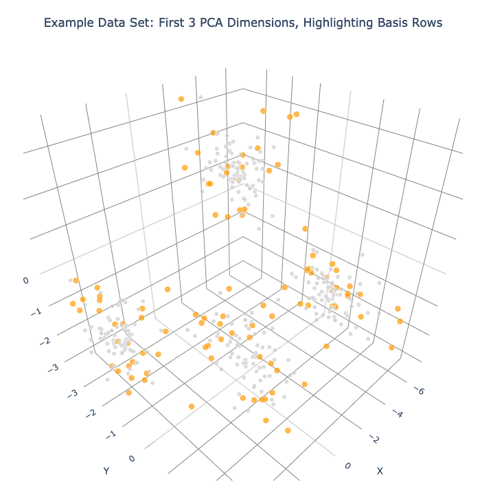
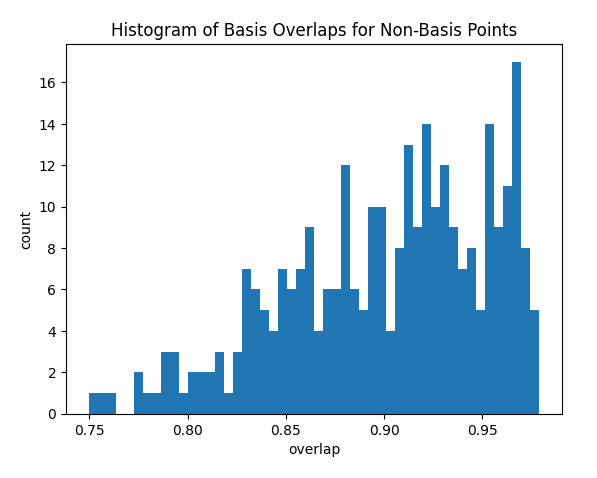
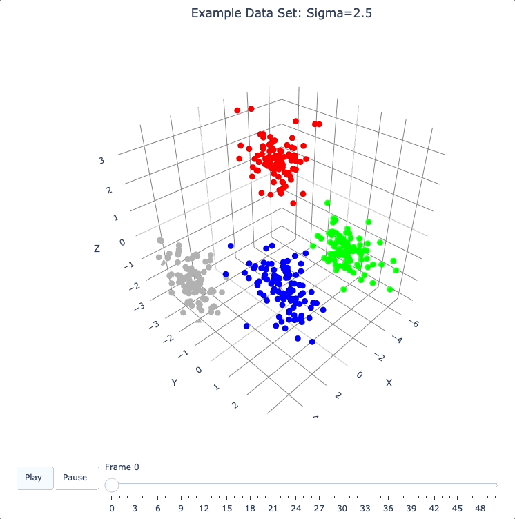
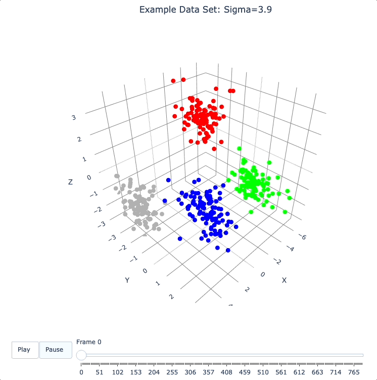
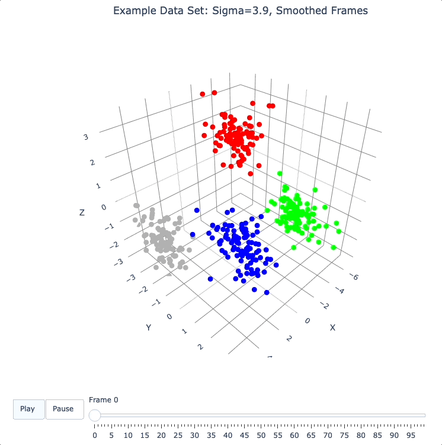
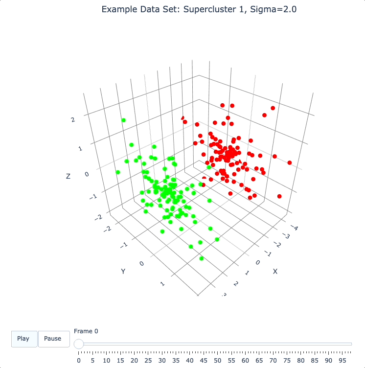

Quick Start
===========

This Quick Start guide is best experienced interactively as a Jupyter notebook (``notebooks/quick_start.ipynb`` in the DQM repository), but the same content is reproduced here.

Dynamic Quantum Mapping (DQM) is a unique system designed for exploring and understanding the intrinsic structure of high-dimensional numerical data. DQM works on any given data set by creating a high-dimensional data-density map and then moving data points toward nearby regions of higher data density. No assumptions are made about the underlying structure of the data. Visual and numerical analysis of the resulting animated 'evolution' of the data can reveal both clusters and extended structures, leading to a rich understanding of relationships between and within different subsets of the data.

This quick-start guide will introduce DQM using a very simple example data set. The example set is simple enough to understand entirely *without* DQM, making it easier to develop your understanding of what DQM is doing and how to interpret DQM results.

(*Note: there's also another demo Jupyter notebook, using DQM on real data, in* ``notebooks/demo_real_data_1.ipynb`` *in the DQM repository.*)

Python Setup
------------

Update Your PYTHONPATH
^^^^^^^^^^^^^^^^^^^^^^

(*See the* :doc:`full installation instructions <installation>` *if you need them.*)

First, make sure the 'dqm' package is in your PYTHONPATH. If it isn't already, you can uncomment the code below and edit as needed.

.. code-block::

    # Note: you need the parent folder of the Python 'dqm' folder in the PYTHONPATH.
    # The 'dqm_repository' folder below is the outer folder, containing the README file, etc.

    #import os, sys
    #sys.path.append(os.path.join(os.path.expanduser('~'), 'dqm_repository'))

Imports
^^^^^^^

Import what we need.

.. code-block::

    import numpy as np
    from dqm import DQM, plot_frames, smooth_frames, get_clusters

    # import PyPlot for some basic plotting
    import matplotlib.pyplot as plt

Create Example Data Set
-----------------------

Create the Data Set
^^^^^^^^^^^^^^^^^^^

The example data set will have 400 data points in 20 dimensions.

There will be 4 spherical clusters of 100 points each, grouped as pairs in 2 'superclusters'.

.. code-block::

    def random_points_in_sphere(num_points, num_dims, radius, rand_seed=0):
        # generate random points within a high-dimensional sphere
        rng = np.random.default_rng(rand_seed)
        points = rng.uniform(low=-1, high=1, size=(num_points, num_dims))
        # for each point, pick a random value between 0 and radius, skewed toward the maximum value (radius)
        for row_idx in range(num_points):
            r = radius * (rng.random() ** 0.5)
            row = points[row_idx, :]
            points[row_idx, :] = r * row / np.linalg.norm(row)  # normalize the row, then multiply by r
        # end for each point/row
        return points
    # end function random_points_in_sphere

    ### build the data set

    # set parameters
    num_points_per_cluster = 100
    num_dims = 20
    cluster_radius= 4
    super_sep = 8  # separation between superclusters
    sub_sep = 5  # separation of clusters within superclusters

    # create 4 spherical clusters
    cluster0 = random_points_in_sphere(num_points_per_cluster, num_dims, cluster_radius, rand_seed=0)
    cluster1 = random_points_in_sphere(num_points_per_cluster, num_dims, cluster_radius, rand_seed=1)
    cluster2 = random_points_in_sphere(num_points_per_cluster, num_dims, cluster_radius, rand_seed=2)
    cluster3 = random_points_in_sphere(num_points_per_cluster, num_dims, cluster_radius, rand_seed=3)

    rng = np.random.default_rng(17)

    # create 2 superclusters by pushing clusters 0 and 1 in a random direction away from the origin and
    # pushing clusters 2 and 3 in the opposite direction
    dir = rng.uniform(low=-1, high=1, size=num_dims)
    dir /= np.linalg.norm(dir)  # normalize
    cluster0 += dir * super_sep / 2
    cluster1 += dir * super_sep / 2
    cluster2 -= dir * super_sep / 2
    cluster3 -= dir * super_sep / 2

    # separate clusters within 1st supercluster
    dir = rng.uniform(low=-1, high=1, size=num_dims)
    dir /= np.linalg.norm(dir)  # normalize
    cluster0 += dir * sub_sep / 2
    cluster1 -= dir * sub_sep / 2
    # separate clusters within 2nd supercluster
    dir = rng.uniform(low=-1, high=1, size=num_dims)
    dir /= np.linalg.norm(dir)  # normalize
    cluster2 += dir * sub_sep / 2
    cluster3 -= dir * sub_sep / 2

    # create the data set by catting all clusters together into single matrix
    dat = np.concatenate((cluster0, cluster1, cluster2, cluster3), axis=0)

    num_rows, num_cols = dat.shape
    print(f'Raw data has {num_rows} rows (points) and {num_cols} columns (dimensions)')

Create Cluster Color Scheme
^^^^^^^^^^^^^^^^^^^^^^^^^^^

Create a color scheme for the clusters and plot the first 3 raw dimensions.

Each row of the color matrix contains RGB data for the corresponding row in 'dat'.

The :func:`plot_frames <dqm.utils.plot_frames>` function below uses the first 3 columns of the input matrix by default. (By construction of our example data set, plotting any 3 raw dimensions here will produce similar results.)

The plot is interactive (not here -- in the Jupyter notebook, or wherever you're running the code). Click and drag to rotate the plot.

.. code-block::

    # create cluster color scheme
    cluster_colors = np.zeros((num_rows, 3))
    cluster_colors[:num_points_per_cluster, :] = np.array([1, 0, 0])  # cluster 0 is red
    cluster_colors[num_points_per_cluster:2*num_points_per_cluster, :] = np.array([0, 1, 0])  # cluster 1 is green
    cluster_colors[2*num_points_per_cluster:3*num_points_per_cluster, :] = np.array([0, 0, 1])  # cluster 2 is blue
    cluster_colors[3*num_points_per_cluster:4*num_points_per_cluster, :] = np.array([0.7, 0.7, 0.7])  # cluster 3 is gray

    # plot the first 3 columns of 'dat'
    plot_frames(dat, color=cluster_colors, title='Example Data Set: First 3 Raw Dimensions')

|

Create DQM Instance
-------------------

Create a DQM instance and store the raw data.

.. code-block::

    dqm_obj = DQM()
    dqm_obj.verbose = True  # default True
    dqm_obj.raw_data = dat

    print('Raw data stored in DQM instance has shape:', dqm_obj.raw_data.shape)

Using PCA
---------

Run PCA
^^^^^^^

Run PCA (results are stored in the instance).

*See the* `Wikipedia PCA page <https://en.wikipedia.org/wiki/Principal_component_analysis>`_ *for background on Principal Component Analysis.*

PCA can be thought of as a simple rotation of the coordinate system for the data space; in the new PCA coordinate system, the 1st dimension has the greatest variance in the data, the 2nd dimension has the next greatest variance in the data, etc.

DQM does not require a PCA transformation, but using PCA is almost always helpful, for 2 reasons:

#. PCA is useful for 'gentle' dimensionality reduction. Here, in the 2 leftmost plots below, the 'elbows' in the plots suggest that using the first 4 PCA dimensions will capture the most important structure in the data. (We'll use more than 4 dimensions below, to emphasize that DQM typically works in high dimension.)
#. Visualization of the first 3 dimensions of the PCA coordinate system allows us to pack as much information as possible into a single 3D plot.

Understanding the plots (left to right):

* Plot 1: PCA eigenvalues are normalized by dividing all of them by the first (largest) one. Note that PCA eigenvalues are proportional to the variance of the data in each PCA dimension.
* Plot 2: Log10 of the normalized PCA eigenvalues from Plot 1. (In some cases, this plot may be more useful than Plot 1.)
* Plot 3: Proportion of cumulative variance in the data for the first :math:`n` PCA dimensions. This plot is just the (renormalized) cumulative sum of the PCA eigenvalues (from Plot 1).

.. code-block::

    dqm_obj.run_pca()

.. image:: images/quick_start_run_pca_plots.png
   :align: center

|

Choose Number of PCA Dimensions
^^^^^^^^^^^^^^^^^^^^^^^^^^^^^^^

Choose how many PCA dimensions to use.

The DQM instance allows us to choose a number of PCA dimensions either:

* explicitly (using ``pca_num_dims``), or
* by setting a threshold for minimum cumulative variance in the data (using ``pca_var_threshold``)

Here (below), we use ``pca_var_threshold``. The instance reports that the threshold of 98% of the total variance is satisfied by using the first 18 PCA dimensions.

.. code-block::

    # choose an explicit number of dimensions (takes precedence if not None)
    # dqm_obj.pca_num_dims = 18
    # OR...
    # choose a minimum proportion of total cumulative variance for the PCA dimensions to be used
    dqm_obj.pca_var_threshold = 0.98

Create Frame 0
^^^^^^^^^^^^^^

The :meth:`create_frame_0 <dqm.DQM.create_frame_0>` method below actually creates the first frame and stores it in the instance.

Creating frame 0 means:

* rotating to the PCA coodinate system
* Truncating ('projecting') simply by dropping the PCA dimensions that we've chosen not to use.

*Note:* if ``pca_transform`` *is set to false, frame 0 will just be a copy of the raw data.*

.. code-block::

    dqm_obj.pca_transform = True  # default True (if False, frame 0 will be a copy of the raw data)
    dqm_obj.create_frame_0()

    print("In the DQM instance, 'frames' (which now stores frame 0) has shape:", dqm_obj.frames.shape)

Plot Frame 0
^^^^^^^^^^^^

In this plot the first 3 dimensions are now PCA dimensions, not raw dimensions, which is why the separation of the clusters has become clearer.

.. code-block::

    plot_frames(dqm_obj.frames, color=cluster_colors, title='Example Data Set: First 3 PCA Dimensions')

|

Working with a Basis
--------------------

Choose a Basis
^^^^^^^^^^^^^^

The 'basis' is a subset of data points that we choose. These basis points will be used to represent all other data points and will form the core of all DQM calculations. (*The word 'basis' here is referencing the idea from linear algebra; see the technical summary* `Understanding DQM <https://github.com/zanderteller/dqm/blob/main/docs/Understanding%20DQM.pdf>`_ *for the technical details.*)

The size of the basis (i.e., the number of basis points) sets a 'resolution' for how much detail we can see in the landscape. A large basis is very computationally expensive (building frames is approximately :math:`O(n^3)`), so in order to use DQM efficiently:

* Start with a smaller basis as you begin exploring a data set.
* Increase the basis size later when you need greater resolution.

For the typical computing power available in today's computers, here is a (very approximate) way to think about basis size:

* Small: up to 500 points
* Medium: 500 to 1,000 points
* Large: 1,000 or more points

The :meth:`choose_basis_by_distance <dqm.DQM.choose_basis_by_distance>` method below chooses the desired number of basis points to be as far away from each other as possible.

.. code-block::

    basis_size = round(num_rows / 4)
    print(f'Using a basis size of {basis_size}')
    print()

    dqm_obj.basis_size = basis_size
    dqm_obj.choose_basis_by_distance()

Plot Frame 0 Again
^^^^^^^^^^^^^^^^^^

Plot frame 0 again, this time highlighting the basis rows in orange.

.. code-block::

    basis_colors = 0.8 * np.ones((num_rows, 3))  # light gray
    basis_colors[dqm_obj.basis_row_nums, :] = np.array([1, 0.6, 0])  # basis rows in orange

    basis_sizes = 7 * np.ones(num_rows)
    basis_sizes[dqm_obj.basis_row_nums] = 10  # make basis-row points bigger

    plot_frames(dqm_obj.frames, color=basis_colors, size=basis_sizes, title='Example Data Set: First 3 PCA Dimensions, Highlighting Basis Rows')

|

Sigma and Overlaps
------------------

Choose Minimum Good Sigma
^^^^^^^^^^^^^^^^^^^^^^^^^

Choose a minimum 'good' value of sigma, based on 'overlap' for non-basis points.

We introduce several key concepts here.

**Sigma**

When DQM builds a data-density map, the first step is to place a multidimensional Gaussian distribution around each data point. Sigma, the width of each Gaussian, is DQM's single main tunable parameter. There is only a single value for sigma -- whatever value is chosen, every Gaussian (around every data point) has that same width.

The starting point for the overall DQM landscape is simply all the Gaussians added together.

For any data set, the extremes are always the same:

* for very small sigma, each point has its own 'well' in the landscape, and nothing will move -- there will be no evolution at all.
* for very large sigma, all points will be within a single giant well and will immediately collapse together during evolution.

The values of sigma in between the extremes are where we can learn interesting things about the structure of the data set.

**Overlap**

For any non-basis point, the 'overlap' of that point in the basis is a measure of how well the basis describes that point. For points far away from any basis point, the overlap will be small, which tells us that the chosen basis will not do a good job in modeling the behavior of that particular point.

Overlap for a given data point is always between 0 and 1, with 1 being a perfect representation. (All basis points have overlap of 1 in the basis.)

See the :ref:`User Guide <Choosing a Basis>` for more about basis overlap. (*For full technical details, see the section on "Reconstruction of Wave Functions in the Eigenbasis" in the technical summary* `Understanding DQM <https://github.com/zanderteller/dqm/blob/main/docs/Understanding%20DQM.pdf>`_.)

**Minimum 'Good' Sigma**

The ability of a set of basis points to describe non-basis points depends on sigma. For a fixed set of basis points and non-basis points, the basis will describe the non-basis points more and more accurately as sigma get bigger. This gives us a way to find a "minimum good value" of sigma that will adequately model the non-basis points in the data set.

The :meth:`choose_sigma_for_basis <dqm.DQM.choose_sigma_for_basis>` method below searches for the smallest value of sigma that satisfies the thresholds for minimum and mean overlap values for non-basis points.

.. code-block::

    dqm_obj.overlap_min_threshold = 0.5  # default 0.5
    dqm_obj.overlap_mean_threshold = 0.9  # default 0.9

    dqm_obj.choose_sigma_for_basis()

    print()
    print('The DQM instance now has a stored value of sigma:', dqm_obj.sigma)

Look at Overlap Distribution
^^^^^^^^^^^^^^^^^^^^^^^^^^^^

Look at distribution of basis overlaps for non-basis rows, using the :meth:`build_overlaps <dqm.DQM.build_overlaps>` method. (By default, the method builds basis overlaps for all non-basis rows.)

.. code-block::

    # by default, the 'build_overlaps' method builds overlaps for all non-basis points in the raw data
    overlaps = dqm_obj.build_overlaps()

    print('for sigma {:.4f}, non-basis overlaps have min {:.3f}, mean {:.3f}, median {:.3f}, max {:.3f}'.\
            format(dqm_obj.sigma, np.min(overlaps), np.mean(overlaps), np.median(overlaps), np.max(overlaps)))
    print()

    plt.hist(overlaps, bins=50)
    plt.xlabel('overlap')
    plt.ylabel('count')
    plt.title('Histogram of Basis Overlaps for Non-Basis Points')
    plt.show()

|

Build Operators
---------------

Build the operators.

The :meth:`build_operators <dqm.DQM.build_operators>` method builds and stores the operator matrices needed to run the DQM evolution.

The operators depend on the raw data, the choice of basis, and the DQM parameters (sigma, mass, and step).

*DQM has 3 main parameters: sigma, mass, and step. Mass and step are both for advanced use only; we don't worry about them here.*

See the :ref:`User Guide <Building Operators>` and the technical summary `Understanding DQM <https://github.com/zanderteller/dqm/blob/main/docs/Understanding%20DQM.pdf>`_ for more about the DQM operators.

.. code-block::

    dqm_obj.build_operators()

    print()
    print("The transpose of the 'similarity' matrix (for converstion of state vectors from raw basis to eigenbasis) has shape:", dqm_obj.simt.shape)
    print("The position-expectation operator tensor has shape:", dqm_obj.xops.shape)
    print("The evolution operator has shape:", dqm_obj.exph.shape)

Build Frames
------------

Build 50 Frames
^^^^^^^^^^^^^^^

We're ready to proceed with the DQM evolution.

Let's start by building 50 frames, using the :meth:`build_frames <dqm.DQM.build_frames>` method, and see what we see.

The animation shows us that the evolution is not done yet at 50 frames, but it's clear that a few points are probably going to be left behind as outliers.

Our next step (below) will be to increase sigma a bit, to get 'clean' formation of all 4 clusters.

.. code-block::

    dqm_obj.build_frames(50)  # default 100

    print()
    print('dqm_obj.frames has shape:', dqm_obj.frames.shape)
    print()

    plot_frames(dqm_obj.frames, color=cluster_colors, title='Example Data Set: Sigma=2.5')

|

Show Formation of 4 Clusters
^^^^^^^^^^^^^^^^^^^^^^^^^^^^

Show clean formation of 4 clusters in the DQM evolution.

The first 50 frames above suggested that some outliers would not be pulled in to the clusters, but we can fix that by increasing sigma.

Here's what we need to do:

* clear the frames we built (for safety, DQM will complain if you try to change the operators when you've already built frames of the evolution)
* increase sigma
* rebuild the operators
* run the whole evolution, by calling the :meth:`build_frames_auto <dqm.DQM.build_frames_auto>` method (which builds frames in batches until all points have stopped moving)

.. code-block::

    dqm_obj.verbose = False  # make output a little cleaner

    dqm_obj.clear_frames()  # this keeps frame 0 by default

    dqm_obj.sigma = 2.9
    dqm_obj.build_operators()
    dqm_obj.build_frames_auto()  # default batch size 100

    print("shape of 'frames' in the DQM instance is now:", dqm_obj.frames.shape)

    plot_frames(dqm_obj.frames, color=cluster_colors, title='Example Data Set: Sigma=2.9')

.. image:: images/quick_start_sigma2p9.gif
   :align: center

|

Show Formation of 2 Superclusters
^^^^^^^^^^^^^^^^^^^^^^^^^^^^^^^^^

Show clean formation of 2 superclusters.

Increasing sigma further will emphasize the 2 superclusters in the data set.

**Important things to notice about the evolution below:**

* **We have 2 superclusters by the end, but the 4 individual clusters are still clearly evident during the evolution: in each supercluster, the 2 clusters approach the final location from opposite directions.**
* **The clusters form linear structures as they approach the supercluster center. The original spherical nature of the individual clusters is lost, but the linear structures contain information about which points were originally closer to or farther from the supercluster center.**

These observations are just a first taste of how the DQM evolution (not just the final state) can yield insights into the structure of the data.

.. code-block::

    dqm_obj.verbose = False  # make output a little cleaner

    dqm_obj.clear_frames()

    dqm_obj.sigma = 3.9
    dqm_obj.build_operators()
    dqm_obj.build_frames_auto()

    print("shape of 'frames' in the DQM instance is now:", dqm_obj.frames.shape)
    print()

    # Note: the 'skip_frames=3' argument means only every 3rd frame is plotted. When dealing
    # with a large number of frames, this can keep the plotting routine from getting too slow.
    plot_frames(dqm_obj.frames, color=cluster_colors, skip_frames=3, title='Example Data Set: Sigma=3.9')

|

Smoothing Frames
^^^^^^^^^^^^^^^^

In the plot above, the evolution is really over by frame 400. (Things are still moving, very slowly, for the last 400 frames).

This is not a horrible state of affairs, but DQM does provide 2 fixes for this problem:

#. You can increase the value of the ``dqm_obj.stopping_threshold`` instance variable before building frames. (A point is considered to have stopped if it moves less then ``stopping_threshold`` distance from one frame to the next.) It's usually set automatically (to ``mean_row_distance / 1e6``). Increasing it will cause points to stop sooner.
#. The :func:`smooth_frames <dqm.utils.smooth_frames>` function below creates a new set of frames, interpolated from the input frames, designed to target a constant average speed of moving points throughout the evolution.

.. code-block::

    plot_frames(smooth_frames(dqm_obj.frames), color=cluster_colors, title='Example Data Set: Sigma=3.9, Smoothed Frames')

|

Other Tools
-----------

Using get_clusters
^^^^^^^^^^^^^^^^^^

The :func:`get_clusters <dqm.utils.get_clusters>` function returns groups of rows that are near each other. A group can be 'near each other' in various ways, for instance in a very long chain. The logic in :func:`get_clusters <dqm.utils.get_clusters>` is somewhat like a simplified version of `DBSCAN <https://en.wikipedia.org/wiki/DBSCAN>`_. (*See the* :func:`get_clusters <dqm.utils.get_clusters>` *documentation for more details.*)

Here (below) we extract:

* the row numbers for the 4 individual clusters from frame 30
* the row numbers for the 2 superclusters from the last frame

Note: for extracting the 4 individual clusters from frame 30, the value for the ``max_dist`` parameter of :func:`get_clusters <dqm.utils.get_clusters>` (dividing the mean row distance by 8) had to be tweaked rather carefully. This is another good example of the power of visualizing the DQM evolution, which let us know that separating the 4 individual clusters around frame 30 would even be possible.

.. code-block::

    # use frame 30 to extract the 4 individual clusters
    cluster_row_nums, cluster_sizes = get_clusters(dqm_obj.frames[:, :, 30], dqm_obj.mean_row_distance / 8)
    print('Found these cluster sizes:', cluster_sizes)

    print()

    # use last frame to extract the 2 superclusters
    supercluster_row_nums, supercluster_sizes = get_clusters(dqm_obj.frames[:, :, -1], dqm_obj.mean_row_distance / 1000)
    print('Found these supercluster sizes:', supercluster_sizes)

Using run_simple
^^^^^^^^^^^^^^^^

The :meth:`run_simple <dqm.DQM.run_simple>` method is indeed very simple -- in fact, here's the code in its entirety:

.. code-block::

    def run_simple(self, dat_raw, sigma):
        self.raw_data = dat_raw
        self.sigma = sigma

        self.create_frame_0()
        self.build_operators()
        self.build_frames_auto()
    # end method run_simple

Here (below) we'll use the :meth:`run_simple <dqm.DQM.run_simple>` method to verify that we can, in a new DQM map, separate the 2 clusters in supercluster 1.

Be aware of the default behavior of :meth:`run_simple <dqm.DQM.run_simple>` (unless you change settings in the instance before you call the method):

* It does a PCA transformation and keeps all PCA dimensions.
* It uses a 'full' basis (all data points are in the basis).

.. code-block::

    # get row numbers for the first supercluster
    row_nums = supercluster_row_nums[0]

    # subselect data and color matrices
    sc1_dat = dat[row_nums, :]
    sc1_cluster_colors = cluster_colors[row_nums, :]

    # build a new DQM map, just for supercluster 1, setting sigma to separate the individual clusters
    sc1_dqm_obj = DQM()
    sc1_dqm_obj.verbose = False
    sc1_dqm_obj.run_simple(sc1_dat, sigma=2)

    print('sc1_dqm_obj.frames has shape:', sc1_dqm_obj.frames.shape)
    print()

    plot_frames(sc1_dqm_obj.frames, color=sc1_cluster_colors, title='Example Data Set: Supercluster 1, Sigma=2.0')

|

Further Reading
---------------

You've now seen the most important core elements in DQM's operation and some of the key aspects of interpreting DQM results. Go forth and explore!

For more information, see:

* the **Demo: Real Data #1** Jupyter notebook (in ``notebooks/demo_real_data_1.ipynb`` in the DQM repository)
* the :doc:`user_guide`
* the technical summary `Understanding DQM <https://github.com/zanderteller/dqm/blob/main/docs/Understanding%20DQM.pdf>`_

|
