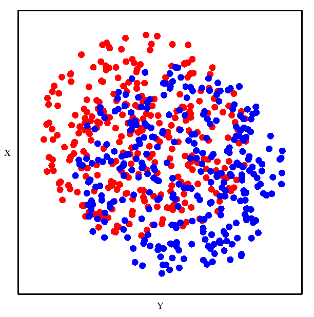
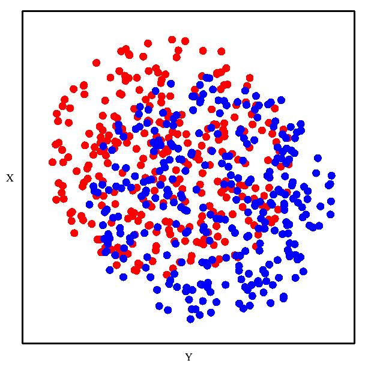
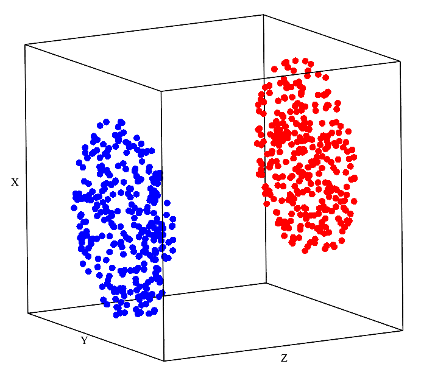

The Value of Animation
======================

Animation in DQM
----------------

In DQM 'evolution', points move 'downhill' in a high-dimensional landscape defined by the data, where regions of higher data density are lower in the landscape. The resulting animation can be viewed in a 2D or 3D plot. (*The trajectories can also be analyzed numerically, of course, as needed.*)

The animated DQM evolution will often be occurring in more dimensions than the plot can show, and so the high-dimensional motion of points in the 2D/3D plot may look strange or counterintuitive. But this strange behavior is exactly the value that the animated evolution is providing: high-dimensional motion of the points, viewed in only 2 or 3 of those dimensions, conveys information about the data landscape from *all* dimensions.

The example below is designed to illustrate this idea as simply as possible.

*Note: in other contexts, many animated data visualizations will use one of the data dimensions as 'time' in the animation. For DQM, this is* **not** *the case. The 'time' in DQM evolution reflects the process of data points moving downhill in a landscape, and is not connected to any individual data dimension.*

Example: Using Animation to See 3D in 2D
----------------------------------------

Colors Don't Look Separable in 2D
^^^^^^^^^^^^^^^^^^^^^^^^^^^^^^^^^

From this 2D plot, it would seem that these red and blue points will not be separable.

|

DQM Separates Colors in 2D
^^^^^^^^^^^^^^^^^^^^^^^^^^

However, DQM evolution shows that they are separable. It looks like magic!

|

Seeing the 3D Plot Explains the 'Magic'
^^^^^^^^^^^^^^^^^^^^^^^^^^^^^^^^^^^^^^^

When we show the same plot from a different angle, where we can see the 3rd dimension of the data space, the motion of the points in the DQM evolution now makes intuitive sense.

|

Analogy to Higher Dimensions
----------------------------

By analogy, even though our visual imaginations fail us in higher dimensions...

When dealing with a DQM evolution in higher dimensions (more than 3), an animated plot in 3 dimensions can convey information from more than 3 dimensions about the structure of the data landscape.

For example: if DQM is working with, say, 20 dimensions, then the motion created by the DQM evolution is occurring in all 20 dimensions. **This means, crucially, that the motion observed in an animated 3D plot is being driven by information from 20 dimensions, even though the visualization is only showing 3 dimensions.**

In this sense, DQM is *not* a 3-dimensional embedding, even though the regular use of 3D plots may seem to suggest otherwise.

|
